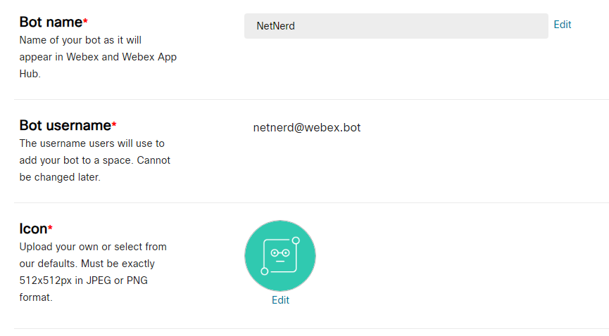

# NetworkGPT

## Bring Beams to Network Streams
Optimize the security of your software-defined infrastructure with Network GPT. From analyzing network traffic patterns, identifying potential network security issues, providing actionable insights and more - enhance the automation and efficiency of your network security program.

## Developer Workflow:
1. Run `pip install -r requirements.txt` to install all prerequisite packages to operate the script

2. Navigate to the Webex Developer portal, create a new [bot token][1]. Note down the bot access token.

    
 
3. Navigate to the `Network_GPT/Authentication` folder, and modify the `.env' file. Replace all the placeholder values with the appropriate controller credentials.

    

4. Navigate to the `Network_GPT/Storage` folder, and open `prompt_kb.xslx' file. There are 4 sheets being used, the values under 'Description' header can be manipulated to suit your needs. It is encouraged for you to modify the prompt description to be more focused on the sort of questions anticipated from your user.
    - `SYSTEM_INIT`: This is the initial system prompt to initialize the ChatGPT engine
    - `INTENT_USER_PROMPT`: This prompt aids in idenfying the intent embedded in the user's question (i.e., whether it is a question about LAN/WAN/Security, etc or if it is oustide the scope of network infrastructure)
    - `INTENT_CATEGORIES`: This is a consolidated list of intents used as a knowledge base for the INTENT_USER_PROMPT
    - `USER_PROMPT`: This prompt wraps around the question asked by the user in the chat interface of the Webex bot

5. Navigate to the root directory (i.e., `Network_GPT`), and run `py main.py`. The following actions will take place.
    - ChatGPT instance is initialized and authenticated
    - Cisco software-defined controllers are authenticated (i.e., SDA:DNAC, SDWAN:vManage, Security: ISE and SMC)
    - Samsung Knox management controller is authenticated
    - Webex bot instance is initialized and authenticated

6. Once the web socket for the bot is open (an INFO logging message will be printed in console signifying the opening of web socket), the user can type questions into the bot's chat interface

7. Ask away about your own network infrastructure

## Example Use Cases:

## Changlog:
<ul>
    <li>v1.0:</li>
    <ul>
        <li>Initial commit. Basic calls to DNAC only. Calls for inventory status checks and site topology implemented.</li>
    </ul>
</ul>

<ul>
    <li>v2.0:</li>
    <ul>
        <li>Ingestion of device and interface information from DNAC</li>
        <li>Ingestion of information on LAN-side issues/problems from DNAC</li>
        <li>Ingestion of device and interface information from vManage</li>
        <li>Ingestion of information on WAN-side issues/problems from vManage</li>
        <li>Ingestion of authentication, authorization policies and local exception rules from ISE</li>
        <li>Formation of centralized network knowledge base, comprising SDA-SDWAN-ISE</li>
        <li>Initialization of ChatGPT bot, integration of bot with centralized knowledge base</li>
        <li>Initialization of Webex Chatbot, integration of bot with ChatGPT and centralized knowledge base</li>
    </ul>
</ul>

<ul>
    <li>v3.0:</li>
    <ul>
        <li>Ingestion of information on top hosts breaching administrator-set alarm threshold levels from Stealthwatch</li>
        <li>Clean up of DNAC, vManage, ISE, Stealthwatch knowledge bases</li>
    </ul>
</ul>

<ul>
    <li>v4.0:</li>
    <ul>
        <li>Refactored code to adopt OOP style. All controllers and their associated methods are encapsulated in individual classes.</li>
        <li>Shifted all code from versions 1.0 to 3.0 into `NetworkGPT/Legacy directory`.</li>
        <li>Clean up of DNAC, vManage, ISE, Stealthwatch knowledge bases</li>
        <li>Integrated Samsung Knox knowledge base into NetworkGPT</li>
    </ul>
</ul>

[1]: https://developer.webex.com/docs/bots 

_This is a passion project by me, and I would love to receive suggestions/advice on how I can improve this chatbot. I will be exploring the usage of vector databases such as PineCone and using wrapper classes via LangChain for a more elegant solution in the future. I can be reached via rodev@cisco.com._
